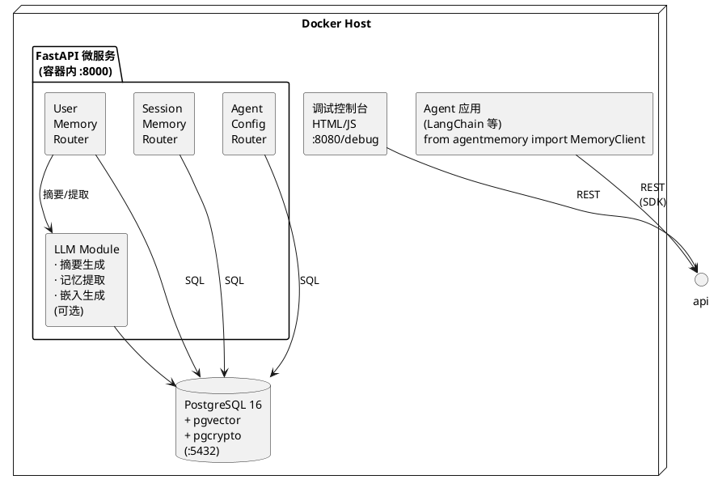
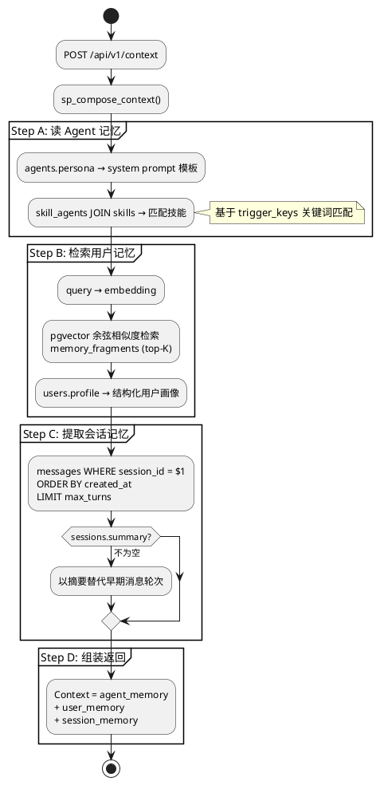
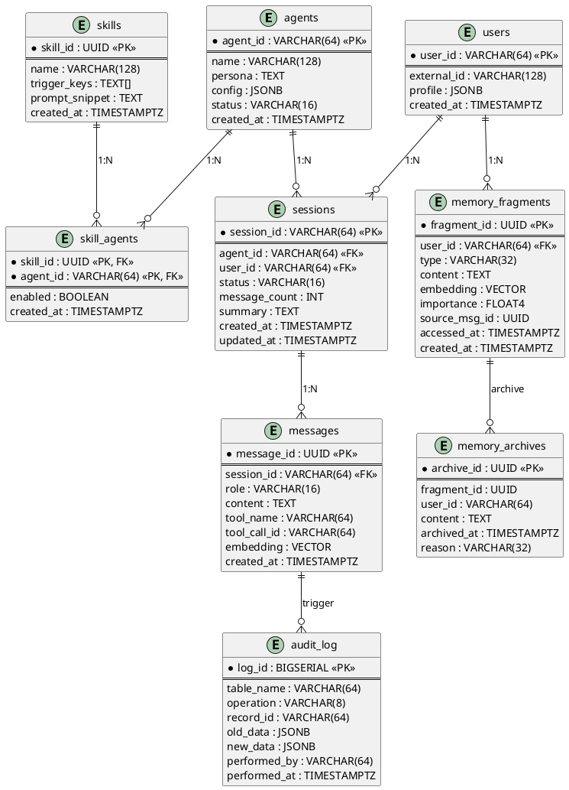
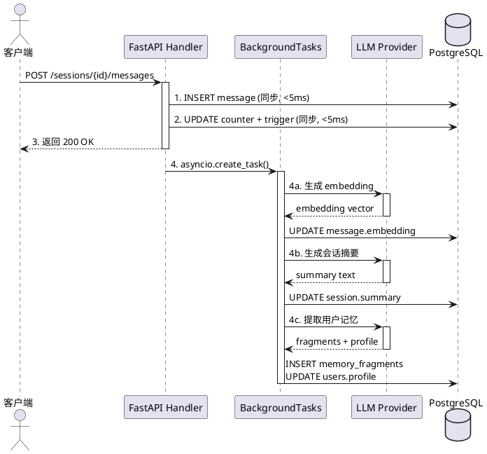
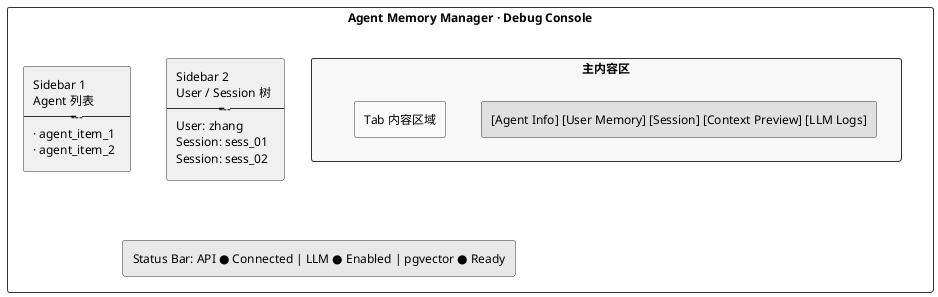

# AI Agent 记忆管理微服务 - 设计文档

## 一、系统架构



**端口约定：** 容器内 FastAPI 监听 **8000**；宿主机通过 Docker 映射 **`${API_PORT:-8080}:8000`** 访问（默认 `http://localhost:8080`）。下文 curl、SDK `base_url`、调试控制台均以宿主机端口为准；容器内服务间仍用 `8000`。

---

## 二、三层记忆模型

| 层级 | 核心表 | 存取模式 | 生命周期 | 注入方式 |
|------|--------|----------|----------|----------|
| 会话记忆 | `sessions` + `messages` | 读写频繁，按 session_id 查询 | 单次会话 | 完整注入最近 N 轮消息 |
| 用户记忆 | `users` + `memory_fragments` | 写少读多，pgvector 语义检索 | 跨会话持久 | top-K 检索结果注入 |
| Agent 记忆 | `agents` + `skills` + `skill_agents` | 读为主，始终全量返回 | 长期/部署级 | 始终注入 system prompt |

### 数据流（以一次 API 调用为例）



---

## 三、数据库设计

### ER 图



### DDL

```sql
CREATE EXTENSION IF NOT EXISTS vector;
CREATE EXTENSION IF NOT EXISTS pgcrypto;

-- ============================================================
-- Agent 级记忆
-- ============================================================

CREATE TABLE agents (
    agent_id    VARCHAR(64) PRIMARY KEY,
    name        VARCHAR(128) NOT NULL,
    persona     TEXT NOT NULL DEFAULT '',
    config      JSONB NOT NULL DEFAULT '{}',
    status      VARCHAR(16) NOT NULL DEFAULT 'active',
    created_at  TIMESTAMPTZ NOT NULL DEFAULT NOW()
);

-- ============================================================
-- Skills（全局技能定义）
-- ============================================================

CREATE TABLE skills (
    skill_id        UUID PRIMARY KEY DEFAULT gen_random_uuid(),
    name            VARCHAR(128) NOT NULL,
    trigger_keys    TEXT[] NOT NULL DEFAULT '{}',
    prompt_snippet  TEXT NOT NULL DEFAULT '',
    created_at      TIMESTAMPTZ NOT NULL DEFAULT NOW()
);

-- Skill-Agent M:N 启用关系
CREATE TABLE skill_agents (
    skill_id    UUID NOT NULL REFERENCES skills(skill_id) ON DELETE CASCADE,
    agent_id    VARCHAR(64) NOT NULL REFERENCES agents(agent_id) ON DELETE CASCADE,
    enabled     BOOLEAN NOT NULL DEFAULT TRUE,
    created_at  TIMESTAMPTZ NOT NULL DEFAULT NOW(),
    PRIMARY KEY (skill_id, agent_id)
);

-- ============================================================
-- User 级记忆
-- ============================================================

CREATE TABLE users (
    user_id       VARCHAR(64) PRIMARY KEY,
    external_id   VARCHAR(128),
    profile       JSONB NOT NULL DEFAULT '{}',
    created_at    TIMESTAMPTZ NOT NULL DEFAULT NOW()
);

-- 跨会话用户记忆单元
CREATE TABLE memory_fragments (
    fragment_id   UUID PRIMARY KEY DEFAULT gen_random_uuid(),
    user_id       VARCHAR(64) NOT NULL REFERENCES users(user_id) ON DELETE CASCADE,
    type          VARCHAR(32) NOT NULL DEFAULT 'fact',
    content       TEXT NOT NULL,
    embedding     VECTOR,
    importance    FLOAT4 NOT NULL DEFAULT 0.5,
    source_msg_id UUID,
    accessed_at   TIMESTAMPTZ NOT NULL DEFAULT NOW(),
    created_at    TIMESTAMPTZ NOT NULL DEFAULT NOW()
);

-- ============================================================
-- Session 级记忆
-- ============================================================

CREATE TABLE sessions (
    session_id    VARCHAR(64) PRIMARY KEY,
    agent_id      VARCHAR(64) NOT NULL REFERENCES agents(agent_id),
    user_id       VARCHAR(64) NOT NULL REFERENCES users(user_id),
    status        VARCHAR(16) NOT NULL DEFAULT 'active',
    message_count INT NOT NULL DEFAULT 0,
    summary       TEXT,
    created_at    TIMESTAMPTZ NOT NULL DEFAULT NOW(),
    updated_at    TIMESTAMPTZ NOT NULL DEFAULT NOW()
);

CREATE TABLE messages (
    message_id    UUID PRIMARY KEY DEFAULT gen_random_uuid(),
    session_id    VARCHAR(64) NOT NULL REFERENCES sessions(session_id) ON DELETE CASCADE,
    role          VARCHAR(16) NOT NULL,
    content       TEXT NOT NULL,
    tool_name     VARCHAR(64),
    tool_call_id  VARCHAR(64),
    embedding     VECTOR,
    created_at    TIMESTAMPTZ NOT NULL DEFAULT NOW()
);

-- ============================================================
-- 系统表
-- ============================================================

CREATE TABLE audit_log (
    log_id        BIGSERIAL PRIMARY KEY,
    table_name    VARCHAR(64) NOT NULL,
    operation     VARCHAR(8) NOT NULL,
    record_id     VARCHAR(64) NOT NULL,
    old_data      JSONB,
    new_data      JSONB,
    performed_by  VARCHAR(64),
    performed_at  TIMESTAMPTZ NOT NULL DEFAULT NOW()
);

CREATE TABLE memory_archives (
    archive_id    UUID PRIMARY KEY DEFAULT gen_random_uuid(),
    fragment_id   UUID NOT NULL,
    user_id       VARCHAR(64) NOT NULL,
    content       TEXT NOT NULL,
    archived_at   TIMESTAMPTZ NOT NULL DEFAULT NOW(),
    reason        VARCHAR(32) NOT NULL DEFAULT 'manual'
);
```

### 索引设计

```sql
-- 主键索引（自动创建）
-- 外键索引（酌情创建）

-- 会话消息时间序查询
CREATE INDEX idx_messages_session_time ON messages(session_id, created_at);

-- 用户记忆查询
CREATE INDEX idx_fragments_user ON memory_fragments(user_id, type);
-- 向量索引：IVFFlat（需先写入一定量数据，再执行 CREATE INDEX）
CREATE INDEX idx_fragments_embedding ON memory_fragments
    USING ivfflat (embedding vector_cosine_ops) WITH (lists = 100);
-- 全文检索索引
CREATE INDEX idx_fragments_fts ON memory_fragments
    USING gin (to_tsvector('simple', content));

-- 会话查询
CREATE INDEX idx_sessions_user ON sessions(user_id, status);
CREATE INDEX idx_sessions_agent ON sessions(agent_id, created_at);

-- Skills 关键词匹配
CREATE INDEX idx_skills_trigger ON skills USING gin (trigger_keys);

-- 消息工具查询
CREATE INDEX idx_messages_tool ON messages(session_id, tool_name)
    WHERE tool_name IS NOT NULL;
```

---

## 四、API 设计

### 端点总览

```
# 核心
POST   /api/v1/context                        ← 三层记忆注入

# Session 管理
POST   /api/v1/sessions
GET    /api/v1/sessions/{session_id}
PATCH  /api/v1/sessions/{session_id}
POST   /api/v1/sessions/{session_id}/messages
GET    /api/v1/sessions/{session_id}/messages

# User 记忆管理
GET    /api/v1/users/{user_id}/profile
PATCH  /api/v1/users/{user_id}/profile
POST   /api/v1/users/{user_id}/memories
GET    /api/v1/users/{user_id}/memories
DELETE /api/v1/users/{user_id}/memories/{fragment_id}

# Agent 管理
POST   /api/v1/agents
GET    /api/v1/agents/{agent_id}
PATCH  /api/v1/agents/{agent_id}
POST   /api/v1/agents/{agent_id}/skills/{skill_id}
DELETE /api/v1/agents/{agent_id}/skills/{skill_id}
GET    /api/v1/agents/{agent_id}/skills

# Skill 管理
POST   /api/v1/skills
GET    /api/v1/skills
GET    /api/v1/skills/{skill_id}
PATCH  /api/v1/skills/{skill_id}
DELETE /api/v1/skills/{skill_id}

# 管理
GET    /api/v1/stats
GET    /api/v1/health
```

### 核心端点详设

#### `POST /api/v1/context` — 三层记忆注入

```json
// Request
{
  "agent_id": "book_bot",
  "user_id": "zhang",
  "session_id": "sess_03",
  "query": "推荐一本进阶 Python 书",
  "options": {
    "max_session_turns": 20,
    "user_memory_top_k": 5,
    "include_skills": true,
    "include_profile": true
  }
}

// Response
{
  "agent_memory": {
    "agent_id": "book_bot",
    "persona": "你是书籍推荐助手，语气亲切、专业...",
    "skills": [
      {"name": "Python进阶书单", "prompt_snippet": "当用户需要进阶 Python 书籍时..."}
    ]
  },
  "user_memory": {
    "profile": {"python_level": {"v": "advanced", "c": 0.85}},
    "fragments": [
      {"type": "preference", "content": "zhang 喜欢 Python 数据分析方向", "score": 0.92},
      {"type": "fact", "content": "zhang 上次推荐了《Fluent Python》", "score": 0.87}
    ]
  },
  "session_memory": {
    "session_id": "sess_03",
    "message_count": 14,
    "summary": null,
    "messages": [
      {"role": "user", "content": "想学 Python", "created_at": "..."},
      ...
    ]
  }
}
```

#### `POST /api/v1/sessions/{session_id}/messages` — 追加消息

```json
// Request
{
  "role": "user",
  "content": "推荐一本进阶 Python 书",
  "tool_name": null,
  "tool_call_id": null
}

// 内部事务操作：
// 1. INSERT INTO messages
// 2. UPDATE sessions SET message_count = message_count + 1, updated_at = NOW()
// 3. 触发器：消息数超阈值 → 标记 summarize_pending
// 4. 触发器：INSERT INTO audit_log
// 5. 异步（LLM 启用时）：生成 embedding 写入 messages.embedding
// 6. 异步（LLM 启用 + 消息数超阈值）：LLM 生成摘要 → UPDATE sessions.summary
// 7. 异步（LLM 启用）：LLM 提取用户记忆 → INSERT INTO memory_fragments
```

#### Agent 与 Skill 管理

```json
// POST /api/v1/agents
{
  "agent_id": "book_bot",
  "name": "书籍推荐助手",
  "persona": "你是书籍推荐助手...",
  "config": {
    "max_session_turns": 20,
    "llm": {
      "api_key": "sk-xxx",
      "base_url": null,
      "model": "gpt-4o-mini"
    },
    "embedding": {
      "api_key": "sk-yyy",
      "base_url": null,
      "model": "text-embedding-3-small"
    }
  }
}

// POST /api/v1/skills
{
  "name": "Python进阶书单",
  "trigger_keys": ["Python", "进阶", "书单"],
  "prompt_snippet": "当用户需要进阶 Python 书籍时，推荐《Effective Python》《Python Cookbook》..."
}

// POST /api/v1/agents/{agent_id}/skills/{skill_id}
// → INSERT INTO skill_agents
```

### 认证

```
Header: X-API-Key: <api_key>
  or
Header: Authorization: Bearer <api_key>
```

`api_key` 通过环境变量 `MEMORY_API_KEY` 设置，为空则跳过验证（本地调试模式）。

---

## 五、LLM 模块设计

### 启用机制

LLM 功能通过 `agents.config` 中的 `llm` 和 `embedding` 两个独立配置块控制，完全可选：

```json
{
  "llm": {
    "api_key": "sk-xxx",
    "base_url": null,
    "model": "gpt-4o-mini"
  },
  "embedding": {
    "api_key": "sk-yyy",
    "base_url": null,
    "model": "text-embedding-3-small"
  }
}
```

- `llm` — Chat 模型配置（摘要 / 记忆提取）。`api_key` 为空 → 降级
- `embedding` — 向量嵌入配置（文本 → 向量）。未配置时 fallback 到 `llm`（向后兼容）

### 三大能力

| 能力 | 触发时机 | 输出 |
|------|----------|------|
| 会话摘要 | 消息数超过 `max_session_turns_threshold` | 写入 `sessions.summary` |
| 用户记忆提取 | 每轮消息追加后异步执行 | 写入 `memory_fragments` + 更新 `users.profile` |
| 向量嵌入 | 消息追加 / 记忆写入 / 上下文检索 | 写入 `embedding` 列 / 用于 pgvector 检索 |

### 降级行为

| 功能 | LLM 启用 | LLM 未启用 |
|------|---------|-----------|
| 会话摘要 | LLM 生成摘要 | 无摘要，始终返回最近 N 轮原文 |
| 用户记忆提取 | LLM 自动提取 | 开发者手动调用 `POST /users/{id}/memories` |
| 向量嵌入 | 调用 embedding API | embedding 列为 NULL |
| 向量检索 | `<=>` 余弦相似度 | 退化为 `to_tsvector` 全文检索 |
| 记忆去重 | 余弦相似度 > 0.85 | 精确内容匹配 |

### 异步执行模型

LLM 调用不阻塞 API 响应：



### 异常处理

```python
try:
    result = await llm_provider.call(prompt)
except (timeout, rate_limit, api_error) as e:
    logger.warning(f"LLM call failed, graceful degradation: {e}")
    # 不影响核心 API 响应，embedding 为 NULL，后续降级检索
```

并发控制：全局信号量限制同时 LLM 请求数（默认 5）。

---

## 六、Python SDK 设计

### 包结构

```
sdk/
├── setup.py
├── agentmemory/
│   ├── __init__.py
│   ├── client.py          # MemoryClient
│   ├── session.py         # Session
│   ├── context.py         # Context, AgentMemory, UserMemory, SessionMemory
│   └── exceptions.py      # MemoryServiceError
```

### 核心类

#### MemoryClient

```python
from agentmemory import MemoryClient

client = MemoryClient(
    base_url="http://localhost:8080",
    api_key="dev-secret"
)

# 一次性 Setup
client.setup(
    agent_id="customer_bot",
    persona="你是电商客服助手...",
    config={"max_session_turns": 20, "llm": {...}}
)
client.add_skill_to_agent("customer_bot", skill_id)

# 会话
session = client.session_start(agent_id="customer_bot", user_id="zhang")

# 对话循环
session.add_message(role="user", content="...")
ctx = session.inject_context(query="...")
llm_response = openai.chat.completions.create(messages=ctx.to_messages())
session.add_message(role="assistant", content=llm_response.choices[0].message.content)
```

#### Session

```python
class Session:
    session_id: str
    agent_id: str
    user_id: str

    def add_message(self, role: str, content: str) -> None:
        """POST /sessions/{id}/messages"""

    def inject_context(self, query: str = None, **opts) -> Context:
        """POST /context → 返回三层聚合"""

    def end(self) -> None:
        """PATCH /sessions/{id} status → 'completed'"""

    def __enter__(self): ...
    def __exit__(self, *a): self.end()
```

#### Context.to_messages()

将三层记忆拼接为 OpenAI 标准消息列表：

```python
class Context:
    agent_memory: AgentMemory      # persona + skills
    user_memory: UserMemory        # profile + top-K fragments
    session_memory: SessionMemory  # messages + summary

    def to_messages(self) -> list[dict]:
        """
        [0] {"role": "system", "content": persona + skills + profile}
        [1..K] {"role": "user", "content": f"[历史记忆] {fragment.content}"}
        [K+1..] session messages (recent N turns)
        """
```

---

## 七、调试前端设计

### 页面布局



### 5 个 Tab 页

| Tab | 内容 |
|-----|------|
| **Agent Info** | 基本信息和 JSON config 编辑器；已绑定的 Skills 列表（开关 toggle） |
| **User Memory** | Profile JSON 查看/编辑；记忆检索框 → 向量 + 全文搜索结果列表；手动添加/删除记忆 |
| **Session** | 选中会话的消息列表（气泡样式）；手动追加测试消息；流程概览 |
| **Context Preview** | 模拟 `inject_context()` → `to_messages()` 的完整输出预览；Token 估算；可复制 JSON/messages 数组 |
| **LLM Logs** | LLM 调用记录表格（时间/操作/耗时/Tokens/状态）；点击展开查看完整 prompt/response |

### 技术实现

- 单一 `static/debug.html` 文件，~800 行
- 零构建依赖：纯 HTML + 原生 JS + 内联 CSS
- hash-based 伪路由，#tab=context 刷新不丢状态
- 暗色主题，CSS Variables
- 全局 `state` 对象管理层级选中状态

---

## 八、高阶数据库技术覆盖

| # | SQL 对象 | 技术 | 说明 |
|---|---------|------|------|
| 1 | `sp_compose_context(agent_id, user_id, session_id, top_k)` | 存储过程 | 三步走：读 Agent 配置 + 检索用户记忆 + 提取会话消息 → 返回结构化 JSON |
| 2 | `tg_check_message_threshold()` + `tg_audit_log()` | 触发器 ×2 | 消息超阈值标记待压缩；全表 DML 操作审计日志记录 |
| 3 | `v_context_preview` + `v_memory_stats` | 视图 ×2 | 封装多表 JOIN 的上下文预览视图；存储统计视图（每用户记忆数、会话数等） |
| 4 | `idx_messages_session_time` + `idx_fragments_embedding (ivfflat)` + `idx_fragments_fts (gin)` | 索引 ×3 | 复合 B-tree 索引 + 向量 IVFFlat 索引 + GIN 全文索引；EXPLAIN ANALYZE 建索引前后性能对比 |
| 5 | 批量消息写入事务 | 事务并发 | INSERT message + UPDATE counter + trigger audit → 同一事务原子提交；演示 READ COMMITTED vs SERIALIZABLE 隔离级别 |
| 6 | `to_tsvector('simple', content) @@ plainto_tsquery(...)` | 全文检索 | 创建 GIN 全文索引后，与 `LIKE '%keyword%'` 进行性能对比 |

---

## 九、Docker 部署

### 容器组成

```yaml
services:
  db:
    image: pgvector/pgvector:pg16
    environment:
      POSTGRES_DB: memorydb
      POSTGRES_USER: memory
      POSTGRES_PASSWORD: memorypass
    ports: [ "5432:5432" ]
    volumes: [ "./docker/init.sql:/docker-entrypoint-initdb.d/init.sql" ]

  api:
    build: ../../..
    ports: [ "${API_PORT:-8080}:8000" ]
    environment:
      DATABASE_URL: postgresql+asyncpg://memory:memorypass@db:5432/memorydb
      MEMORY_API_KEY: dev-secret
    depends_on: [ db ]
```

### 开发者一键启动

```bash
docker compose up -d
curl http://localhost:8080/api/v1/health
# → {"status":"ok","pgvector":true,"llm_enabled":false}
```

---

## 十、项目目录结构

```
AgentMemoryManager/
├── docker/
│   └── init.sql                      # 数据库 DDL + 高阶 SQL 对象
├── src/
│   ├── main.py                       # FastAPI 入口
│   ├── config.py                     # 配置（环境变量）
│   ├── database.py                   # 异步 SQLAlchemy + asyncpg
│   ├── routers/
│   │   ├── context.py                # POST /api/v1/context
│   │   ├── sessions.py               # 会话管理路由
│   │   ├── users.py                  # 用户记忆管理路由
│   │   ├── agents.py                 # Agent 管理路由
│   │   ├── skills.py                 # Skill 管理路由
│   │   └── admin.py                  # stats / health
│   ├── models/
│   │   └── database.py               # SQLAlchemy ORM 模型（全部表）
│   ├── services/
│   │   ├── context_service.py        # sp_compose_context 调用封装
│   │   ├── session_service.py
│   │   ├── user_service.py
│   │   └── agent_service.py
│   ├── llm/
│   │   ├── provider.py               # OpenAI 兼容 HTTP 客户端
│   │   ├── extractor.py              # 用户记忆提取 prompt
│   │   ├── summarizer.py             # 会话摘要 prompt
│   │   └── embedder.py               # 文本 → 向量
│   └── static/
│       └── debug.html                # 调试控制台
├── sdk/
│   ├── setup.py
│   ├── requirements.txt
│   └── agentmemory/
│       ├── __init__.py
│       ├── client.py
│       ├── session.py
│       ├── context.py
│       └── exceptions.py
├── Dockerfile
├── docker-compose.yml
├── requirements.txt
├── pyproject.toml
├── .env.example
├── LICENSE
└── docs/
    ├── 设计.md
    ├── 用户手册.md
    └── superpowers/plans/
```
